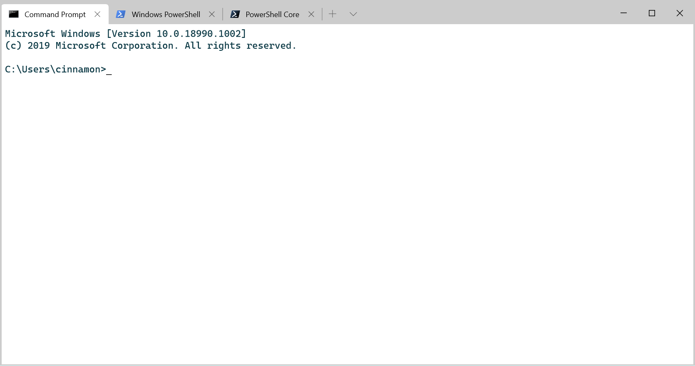
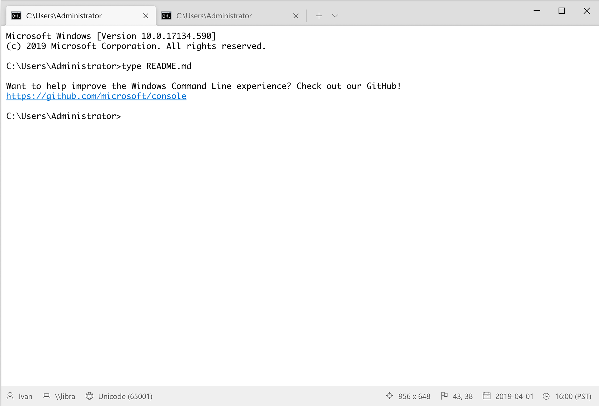

# Recent News / Releases

## [Terminal 1910 was released on Wednesday][1]

* Announced dynamic profiles and cascading settings
* New tabs from WinUI

* These look very much like our original mockups from March :)

# Current Status

## Plan for 1911 is in place

* Accessibility improvements
* Suppress application title
* Progress on search functionality
* UI tweaks
* Bug fixes
* (Fewer features because of Ignite)

## Cascadia Code

* Features currently in scope:
    * UFO conversion
    * Character extensions (Cyrillic, Greek, and Vietnamese)

## Ignite Session

* Carlos and Kayla are delivering a 45-minute breakout session at Ignite

# [Windows In-box Console/ConHost 20H1 Issues][2]

# [Terminal 1911 Work][3]

# [Terminal Roadmap][4]

[1]: https://devblogs.microsoft.com/commandline/windows-terminal-preview-1910-release/
[2]: https://github.com/microsoft/terminal/milestone/9
[3]: https://github.com/microsoft/terminal/milestone/16
[4]: https://github.com/microsoft/terminal/blob/master/doc/terminal-v1-roadmap.md